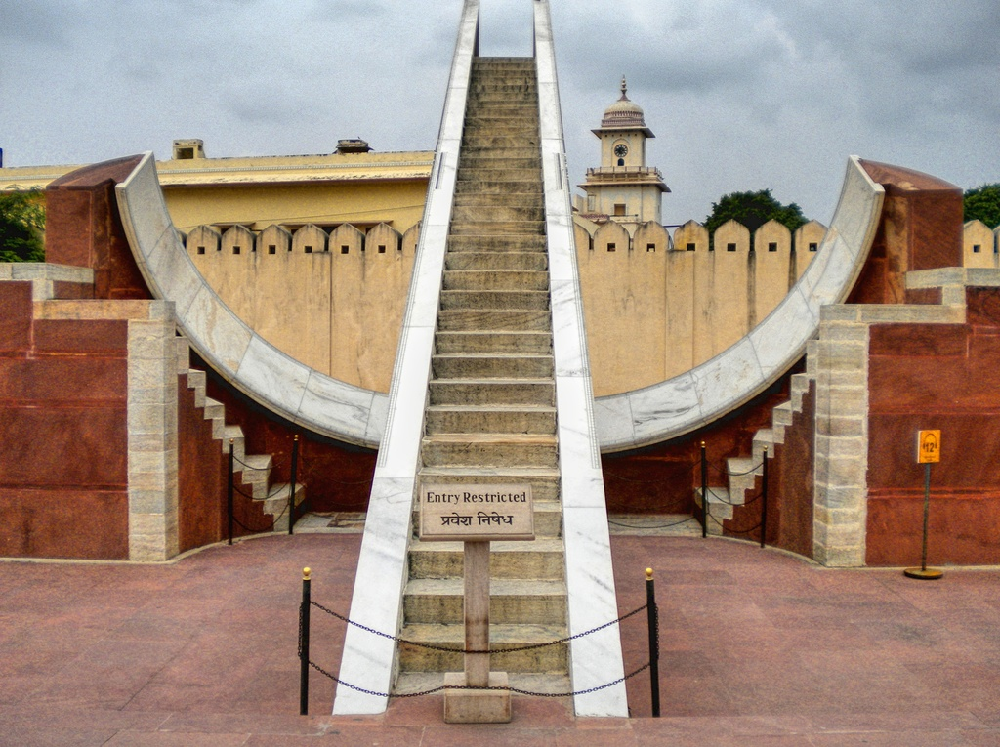
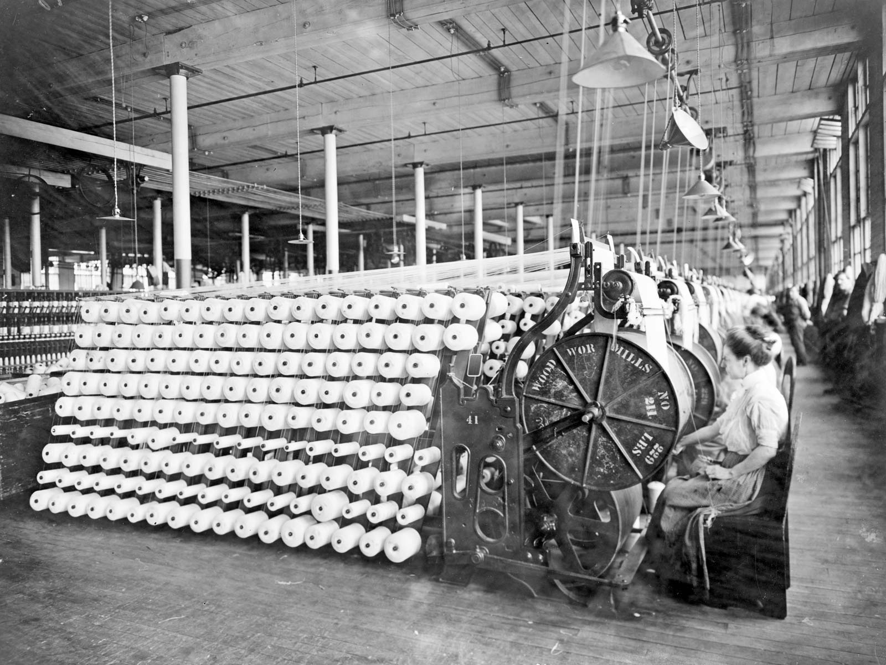
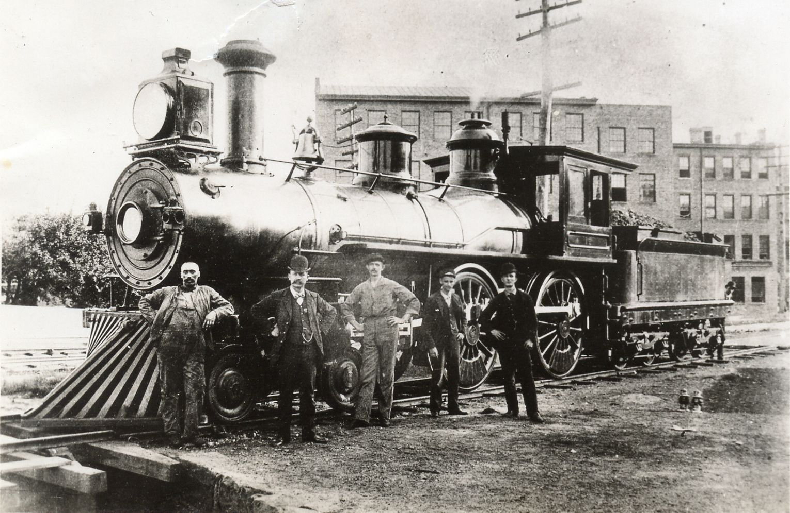
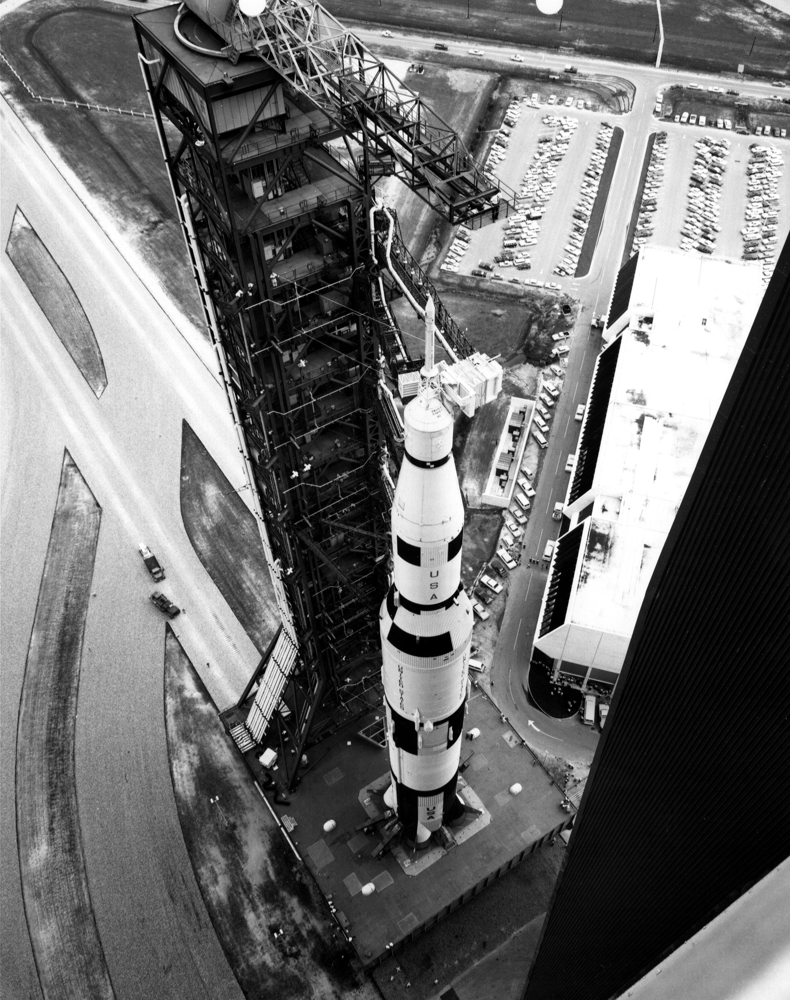
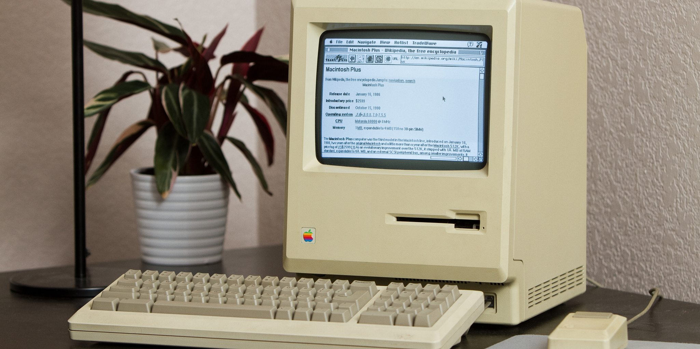

1. Introduction
===============

.. toctree::
   :maxdepth: 4

.. role:: raw-html(raw)
   :format: html

Long ago, during 1500 B.C. in ancient Egypt, the Egyptians were on the verge of a major invention, the invention
of sundials. How do we measure time? Back in the day, the measurement was not like how today's clocks measure time. In fact
for 3 millenia or more the basic unit of time was the period of daylight. The Egyptians broke the period of sunrise to
sunset in 12 parts, giving us the forerunner of today's hours. Unlike the constant length of hours as measured today by
our clocks the Egyptian hour was not of constant length; infact it varied with seasons and was also based on the length of the
day. It also varied from place to place on the surface of the Earth. Most importantly, time as a measurable concept
effectively ceased during the time of darkness when there was no sunlight. The Egyptians did not account of the hours the
light was not present.

   World's Largest Sundial at Jantar Mantar, India :raw-html:` `
   *credits:* `Google Images <https://static.trip101.com/paragraph_media/pictures/000/027/426/large/SunDialJM.jpg?1460623577>`_

The need to measure time independently of the sun eventually gave rise to various devices, most notably sandglasses,
waterclocks and candles. The first two of these utilized the flow of some substance to measure time, the latter the
steady fall in the height of the candle. All three provided a metaphor for time as something that flows continuously,
and thus began to shape the way we think of time. Though their accuracy was never great, these devices not only provided
a way to measure time without the need for the sun to be visible in the sky, they also provided the basis for a concept
of time that did not depend upon the length of the day. The evolution of time measuring device was revolutionary and
ever since the early days mankind has caused a revolution in some form or another.

As humans we experience a revolution every now and then in our lifetime. In the field of technology, we had our
`First Industrial Revolution <https://en.wikipedia.org/wiki/Industrial_Revolution>`_ during the 1780-1840 period where we transitioned from hand made goods to automated
machines for increasing production and this lead to big shift in economy and lives. Mechanical machines were used which
could work on potential energy and kinetic energy and which could help reduce human effort by harnessing the natural
powers available.

   First Industrial Revolution, Textiles :raw-html:` `
   *credits:* `Britannica <https://cdn.britannica.com/46/189446-050-B9B448DA/Women-working-machines-American-Woolen-Company-Boston-1912.jpg>`_

Likewise, we had our `Second Industrial Revolution <https://en.wikipedia.org/wiki/Second_Industrial_Revolution>`_ during the 1870-1920 period. In this revolution
we saw widespread adoption of new technologies like telegraph and railroad networks for transportation. Gas and Water
supply systems were setup and likewise sewage treatment plants were installed. A majority of mechanical machinery were
transitioned to electrified units where electricity was used.

   Second Industrial Revolution, Railroads :raw-html:` `
   *credits:* `Pinimg <https://i.pinimg.com/originals/c0/09/33/c0093342d5bb8660e71b2f6ab3392675.jpg>`_

We then had the `Scientific Technological Revolution <https://en.wikipedia.org/wiki/Technological_revolution>`_
from 1940-1970 period, where nationwide communications, electronic computers and space technology was developed.
This revolution brought about changes like personal computers and which replaced bulky mainframe systems.

   Scientific Technological Revolution, Space Technology :raw-html:` `
   *credits:* `NASA <https://www.nasa.gov/centers/kennedy/images/content/662784main_saturnV.jpg>`_

We finally have the `Third Industrial Revolution <https://en.wikipedia.org/wiki/The_Third_Industrial_Revolution>`_ also called as **Digital Revolution** from 1975-2020 which marked the birth of
the internet, personal handheld devices, navigation systems and more sophisticated surveillance networks. This
revolution is the one which saw the maximum amount of growth both economically and technologically for the entire world.

   Third Industrial Revolution, Computers and Internet :raw-html:` `
   *credits:* `Dailydot <https://www.dailydot.com/wp-content/uploads/b8e/54/e0b23b40a24e3f20208dbefd48cd0219.jpg>`_

We came across the term artificial intelligence and how it can change the way we operate in our lives. We are slowly
transitioning from the **Digital Revolution** to the **A.I. Revolution** which will completely transform human experiences.

1.1 Objective of the book
-------------------------

This book, comprises of a particular part of research which helps us reason why AI works the way it works. As part of
the A.I. Revolution, it's important to understand the dark areas which causes mysterious human level results on
complicated problems. Interpretability is very necessary for human understanding, and as humans we tend to unravel the
complicated day-to-day processes so as to better understand our environment and conditions. We are embarrassingly curious,
by nature and tend to explore every area we possibly can. While sometimes, this may act against us, almost always, it
leads to surprising innovations and breakthroughs. While we can possibly take the results generated by the artificially developed
machines for granted, it is human to know the underlying principles which governs its decisions. The objective of this book is
to explore a particular area of Computer Vision, specifically Image Segmentation and understand the underlying mechanics of the
algorithm essentially deciphering how things work internally so as to give out a particular output. Likewise, we also try to
understand the reasons why those decisions were arrived by taking help of explainability.

1.2 About the book
------------------

This book has a simple structure and as more research is done, it can be extended further with more experiments and
results. As for the layout of this book, we first touch upon what Computer Vision is, since that is the area we intend to
explore. We would then like to know how computer vision systems work internally, what causes it to produce near-human level inferences,
what are the various sub-domains of this vast field and the applications where we encounter it in our daily life. We then,
understand what is interpretability in general and its need in understanding black box models. We try to understand the bias
in AI which is prevalent due to the inherent nature of human bias(which apparently gets passed on to machines in their underlying
algorithms). Since the field of computer vision is very vast, we decide to apply our interpretability methods on a specific
domain, in our case Image Segmentation. The following set of chapters help us get a fair idea of Semantic, Instance and
Panoptic Segmentation Techniques. We then see 3 algorithms which can help us understand interpretabilty in Image Segmentation
techiques - Grad-CAM, Grad-CAM++ and Score-CAM. Lastly, we reason about our observations and give a subjective conclusion
based on our experiments and tests. Please do note, that we have made use of PyTorch, a deep learning framework developed
by `Facebook AI Research (FAIR) <https://ai.facebook.com/research/>`_, for our work.

