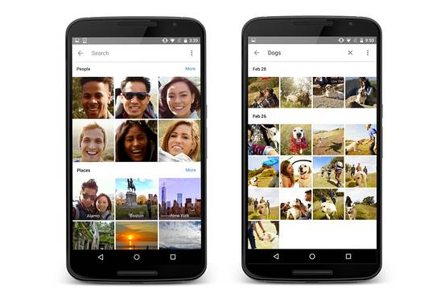
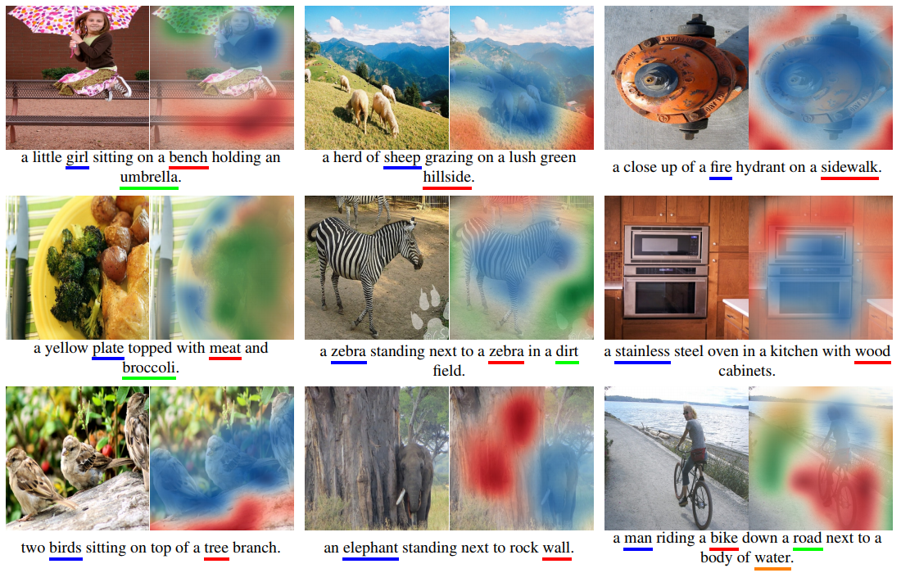

2.5 Image Captioning
====================

.. toctree::
   :maxdepth: 2

.. role:: raw-html(raw)
   :format: html

2.5.1 What is Image Captioning?
-------------------------------

Unlike earlier mentioned methods, which were specifically related to vision, the topics which we discuss further
involve not just vision related algorithms but also natural language processing based concepts. Image Captioning is a
particularly interesting research area where we have hybrid architecture of Convolutional Neural Networks (CNN) for
encoding images and Recurrent Neural Networks (RNN) for generating textual captions describing the image. To put it in
more concise terms, just like a human would describe given an image what lies in the image, we would expect our algorithms
to predict a caption given an image.

.. figure:: ../../../_static/captioning.png
   :align: center
   :width: 700px

   Image Captioning Architecture :raw-html:` `
   *credits:* `medium <https://miro.medium.com/max/1024/1*vzFwXFJOrg6WRGNsYYT6qg.png>`_

2.5.2 Applications of Image Captioning Algorithms
-------------------------------------------------

   Google Photos :raw-html:` `
   *credits:* `wsj <https://si.wsj.net/public/resources/images/BN-IQ288_Google_G_20150528104500.jpg>`_

Although, it's hard to come across real world applications of Image captioning based systems, there are few similar
applications where captioning is used for managing photo libraries if not directly then on similar lines. Google Photos make uses of image captioning to
automatically group photos into relevant categories. For instance, say you went on a hike and clicked a few pictures of
the mountains and cliffs. Those photos along with all other photos which you must have taken previously, gets categorized
into **mountains**; likewise, if you have photos of boats or ships or your sailing experiences, those get categorized into
**sailing**, etc. Other possible places where image captioning can be employed is in optical character recognition systems.
Given an image of a mathematical formulae or any equation or a text, is it possible to infer the words or symbols from the image and
create an automated text document from the same?

   Multi-Modal Image Captioning Intuition :raw-html:` `
   *credits:* `miro <https://miro.medium.com/max/1100/0*mCHDMNdwb_gB1Rj9.>`_

2.5.3 Challenges faced by Image Captioning Algorithms
-----------------------------------------------------

Understanding a scene is not an easy task. Sometimes the language model is not so rich in vocabulary and so getting
lexically correct captions can be difficult. Also, models have hard time working with occluded objects and with significant
noise can cause less information to be perceived then expected.