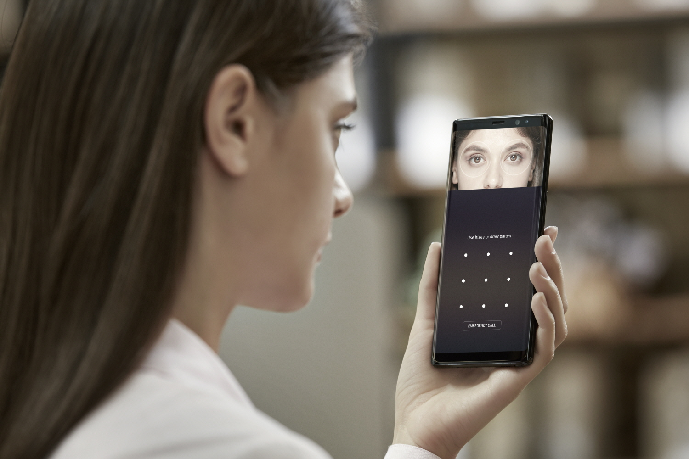

2.1 Image Classification
========================

.. toctree::
   :maxdepth: 2

.. role:: raw-html(raw)
   :format: html

2.1.1 What is Image Classification?
-----------------------------------

Image Classification is one of the most popular application of computer vision. The idea is quite simple and there are
many techniques to help us achieve it. While I won't be covering the various techniques which help us achieve Image
Classification, I will be giving you the higher level overview of the concept. As the name suggests, given an image we
want to classify in which category does it belong to or in more subtle terms, describe a picture in one or two words.
The algorithm which help us achieve Image Classification are Convolutional Neural Networks (CNNs). This algorithm when
tweaked and modified can lead to various architectures with different performance scores. Over the period of 6-7 years,
a lot of research is done in this domain. Some popular architectures using CNNs as their core component include -
**Residual Networks (ResNets)**, **GoogleNet**, **VGG-16**, etc.

.. figure:: ../../../_static/classification.gif
   :align: center
   :width: 700px

   Intuition of a Binary Image Classification Problem :raw-html:` `
   *credits:* `becominghuman <https://becominghuman.ai/building-an-image-classifier-using-deep-learning-in-python-totally-from-a-beginners-perspective-be8dbaf22dd8>`_

2.1.2 Applications of Image Classification Algorithms
-----------------------------------------------------

We come across image classification algorithms in our daily lives and yet we don't really know that we have been using
them since a long time. The biometric face recognition and Iris classification on your mobile phone is nothing but
Image Classification under the hood. Figuring out whether a face is the real owner or the Iris is the one registered on
device or is it someone new? - such cases are tackled with human level accuracy by our phones. Ever used Google Photos?
If you must have observed, Google can segregate your photos based on your experiences and based on people. A simple
search of **mountains** can bring up all the pictures on your phones where there are mountains. Or if you miss your mom,
simply typing **Mom** will show up pictures of you with your mom. All these are applications of Image Classification,
and they have been around for quite a while.

   Iris Detection and Classification in Samsung Galaxy Note 8 :raw-html:` `
   *credits:* `daumcdn <https://img1.daumcdn.net/thumb/R720x0.q80/?scode=mtistory2&fname=http%3A%2F%2Fcfile5.uf.tistory.com%2Fimage%2F992BEE385E37A30315CA3D>`_

2.1.3 Challenges faced by Image Classification Algorithms
---------------------------------------------------------

One important thing to note with respect to Image Classification is that, given an image, it does not localize any
particular object in the image. What do we mean by localize? By localization, we mean the location of the object in the
image. An object can be present in the left half of the image, the right half, the center, or the top or bottom, etc. It
can be anywhere in the image. As long as it is in the image,  the classification algorithm works efficiently. The caveat
of classification algorithm is that it cannot be used for detecting object locations relative to image or for figuring out
multiple instances of the same object in the image. Such problems are addressed by Object Detection algorithms.

   Image Classification vs Localization with Classification :raw-html:` `
   *credits:* `technobezz <https://www.technobezz.com/files/uploads/2017/10/How-To-Fix-Galaxy-Note-8-Iris-Scanner-Issues.jpg>`_

