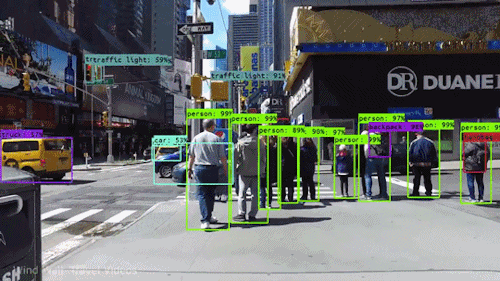
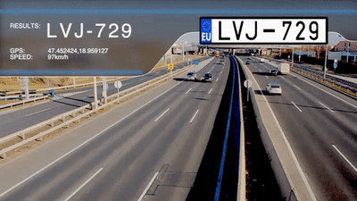

2.2 Object Detection
====================

.. toctree::
   :maxdepth: 2

.. role:: raw-html(raw)
   :format: html

2.2.1 What is Object Detection?
-------------------------------

Object detection is yet another interesting domain of Computer Vision. It builds upon the idea of
`Image Classification <https://interpretability-in-image-segmentation-techniques.readthedocs.io/en/latest/chapters/chap2/classification/classification.html>`_.
If you recall, Image Classification simply classifies an image into multiple categories. If we have multiple instances
of the same object in the image, the classification algorithm won't be able to identify multiple instances. This drawback is covered by Object
Detection. Apart from telling if a particular object is present in the image or not, it can figure out where exactly that
object lies. It gives a bounding box location of the occurrence of that object in the image. Say you have a picture of
all the cats in your house. A classification algorithm will just give out a label cat; but the object detection algorithm
will not only give out the label but will place a bounding box around all the cats in the picture. This gives us more
control over information in the image. If we want to find out how many animals are present in the house, how many people
are present in the house, we would use object detection.

   Object Detection in Real Time :raw-html:` `
   *credits:* `medium <https://miro.medium.com/max/1000/1*NLnnf_M4Nlm4p1GAWrWUCQ.gif>`_

2.2.2 Applications of Object Detection Algorithms
-------------------------------------------------

Now that you have a good higher level intuition of what object detection algorithms are and the way they work, can you
think of any instances where you must have come across object detection algorithms in your daily life? I assume everyone
must be aware of the social media platform Facebook. We all must have at some point or other, tagged our friends, our
family members or other relatives in various posts of ours. Over the period of time, Facebook will autosuggest tags on
faces of people it seems familiar enough in your feed. Say you have tagged your dad and your brother quite often in your
pictures; chances are that when you post a new picture, an autosuggest will draw a box around their faces asking if you would
like to apply the automated tags. This is a classic example of object detection. Likewise, another very popular application
of object detection is for vehicle license plate identification. On highways, cameras can capture license numbers of
speeding vehicles. It is not only sufficient for the camera to find out the speeding vehicles from the several frames it
captures, but also important for it to detect the location of the number plate in the image and more specifically the
license number for optical character recognition. There are many other places where object detection is used, from self
driving cars to sign language detection, etc.

   Facebook autotagging localized face suggestions :raw-html:` `
   *credits:* `ibxk <https://img.ibxk.com.br/2020/01/30/30141154010379.jpg>`_

2.2.3 Challenges faced by Object Detection Algorithms
-----------------------------------------------------

While object detection is powerful then image classification, it still has some caveats. Say, we are trying to determine
the **EXACT** location in the human body which has cancer. I deliberately strongly typed exact, because Object detection
does not determine the exact location. By exact location, I mean it does not trace the boundary of the object. It merely
draws a bounding box around the region of interest. This is not sufficient if we would like to surgically operate on a
patient who has a tumor in a particular organ of a body. I am pretty much sure nobody wants a square shaped cut made
through their body organ. The exact location of an particular object in an image with pixel level granularity is given by
Image Segmentation. We will discuss this in later chapters.

   Real time license plate detection :raw-html:` `
   *credits:* `gfycat <https://thumbs.gfycat.com/MedicalNiftyFritillarybutterfly-size_restricted.gif>`_

