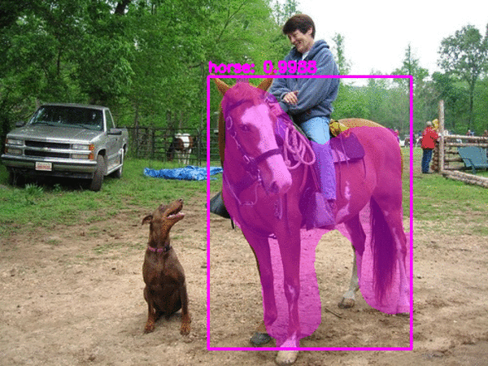

2.3 Image Segmentation
======================

.. toctree::
   :maxdepth: 2

.. role:: raw-html(raw)
   :format: html

2.3.1 What is Image Segmentation?
---------------------------------

Remember as a kid, when learning how to use scissors, we were made to cut simple geometric shapes - circles, triangles,
squares, etc drawn on a single sheet of drawing paper. Consider that single sheet of paper as an image; and consider
the various shapes drawn on that sheet of paper as objects. The very act of carefully tracing the edges of the
various geometric shapes with our scissors and making sure we cut through the paper and retain the original object shapes
is called **segmentation**. After cutting all the shapes from the paper, what is left behind is called the background
of the image. This is the simple intuition behind how image segmentation works.

   Image Segmentation using Mask R-CNN :raw-html:` `
   *credits:* `pyimagesearch <https://s3-us-west-2.amazonaws.com/static.pyimagesearch.com/opencv-mask-rcnn/mask_rcnn_example02.gif>`_

2.3.2 Applications of Image Segmentation Algorithms
---------------------------------------------------

To better understand segmentation, if I ask you what are the important (salient) elements you can figure out from the
above image, what would you say? Seeing the above image, what does our eyes capture in a fraction of a second. Our eyes
are very acute in segmenting instances given a particular scene. From the above image the important elements are people,
animals and a vehicle. Precisely figuring out the location of all people, both animals and a single vehicle with pixel
level granularity and masking them (for sake of visualizing the observed segments) is called Segmentation of an image.
Now, that you understand how segmentation works, where can you imagine finding one in real life? Do you recall coming
across any experience where segmentation is used?

.. figure:: ../../../_static/selfdriving.gif
   :align: center
   :width: 700px

   Self-driving car using DeepLab-V3 Segmentation Model :raw-html:` `
   *credits:* `jeremyjordan <https://www.jeremyjordan.me/content/images/2018/05/deeplabcityscape.gif>`_

Ever seen a self driving Tesla? If yes, cool; if not don't worry, neither have I! How do you think, a commercial vehicle
like Tesla is rolled out in the market with people actually buying them and driving them with autopilot mode ON? Image
Segmentation at it's best!!! The car not only has to segment the roads and other vehicles but also the most important
elements - the pedestrians. We surely don't want a self-driving car to run over a human being. Understanding the road
scene, the traffic around, etc requires far more than precise real-time segmentation, albeit segmentation is the core idea
around the entire concept.

   Brain tumor segmentation from MRI scans :raw-html:` `
   *credits:* `ytimg <https://i.ytimg.com/vi/7wCC2NaVLjs/maxresdefault.jpg>`_

Another major application of image segmentation methods is in medical image analysis. Imagine a person has a brain tumor.
How big is the tumor? For an operation, how can the surgery be precise and accurate so as to avoid slicing any other vital
part of the brain? Such challenges are tackled by image segmentation algorithms.

2.3.3 Challenges faced by Image Segmentation Algorithms
-------------------------------------------------------

However, currently these algorithms are not robust to occlusions and noise and hence they still have a long way to go
before being perfect for full fledged deployment without human supervision.

