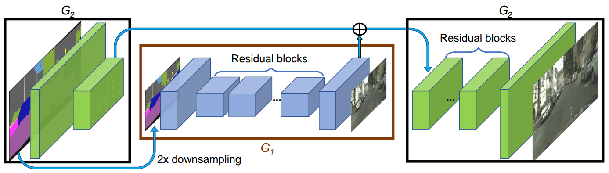
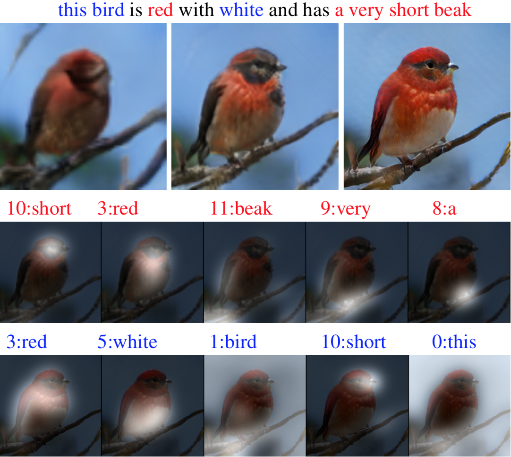
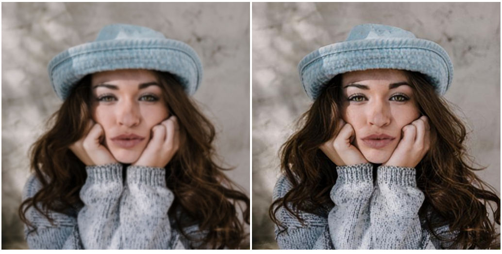

2.6 Image Synthesis
===================

.. toctree::
   :maxdepth: 2

.. role:: raw-html(raw)
   :format: html

2.6.1 What is image synthesis?
------------------------------

Like Image captioning, Image synthesis too is a fairly new topic and a much less explored area. If you recall, in image
captioning we tried to find descriptive texts given an image. Image synthesis is an inverse of image captioning process.
Here we try to create or synthesize an image from a textual caption or an image itself. You must be wondering how can we create an image from
a text or from another image. Turns out there exists an algorithm which has become quite popular in the field of computer vision. That algorithm
is called Generative Adversarial Networks (GANs). The idea behind GANs is that it learns the distribution of an entity and tries
to sample new instances knowing the dynamics of that known entity. Still sounds a bit strange? Let me give a very simple
example. Say you are to draw new images of triangle. Yes, a simple geometric shape - a triangle. How do we draw a new triangle?
Well, we need to know the distribution of all triangle images which we have so as to let the algorithm create new triangle images.
The criteria for the triangle is that it has 3 sides where the sum of any two sides is greater than the third side. If an algorithm
is exposed to a million images of triangles of different length of each sides, of different color and different background then it can
create a probability distribution having observed the properties of these images. It can then sample from the distribution and create
a new image of a triangle altogether. This is how image synthesis works in simple terms.

   Intuition behind Image Synthesis systems :raw-html:` `
   *credits:* `theaisummer <https://theaisummer.com/assets/img/posts/gan-computer-vision-video-synthesis/pix2pixHD.png>`_

2.6.2 Applications of Image Synthesis Algorithms
------------------------------------------------

   Synthetic data (image) generation from textual captions :raw-html:` `
   *credits:* `medium <https://miro.medium.com/max/2344/1*q2lk-yorNewTJ5mJm8qcvw.png>`_

Image Synthesis can have many potential applications the most important being, data generation. Nowadays, we usually have
shortage of data for specific tasks. In such places we can create synthetic data given a text. This synthetic data can then be
used with actual data for training our algorithms. They can be used to balance imbalanced datasets. Likewise, another major
application is super resolution. Given a blurry image, how can we get a new image with higher and enhanced resolution? Image-to-image
translation can help in super resolution. Poor resolution images can be enhanced efficiently.

   Super Resolution using Image synthesis for sharpening blurred or hazy images :raw-html:` `
   *credits:* `miro <https://miro.medium.com/max/2344/1*q2lk-yorNewTJ5mJm8qcvw.png>`_

2.6.3 Challenges of Image Synthesis Algorithms
----------------------------------------------

A lot of work is still needed for image synthesis to be fully state-of-the art. Although the primary subject in the image is
synthesized with near human precision, the background is yet not constructed or synthesized in a good way essentially only localizing
information to the subject in itself. If a generator produces an especially plausible output, the generator may learn to produce only
that output. In fact, the generator is always trying to find the one output that seems most plausible to the discriminator. If the
generator starts producing the same output (or a small set of outputs) over and over again, the discriminator's best strategy is to
learn to always reject that output. But if the next generation of discriminator gets stuck in a local minimum and doesn't find the
best strategy, then it's too easy for the next generator iteration to find the most plausible output for the current discriminator.
Each iteration of generator over-optimizes for a particular discriminator, and the discriminator never manages to learn its way out
of the trap. As a result the generators rotate through a small set of output types. This form of GAN failure is called mode collapse.

https://machinelearningmastery.com/impressive-applications-of-generative-adversarial-networks/
https://developers.google.com/machine-learning/gan/problems