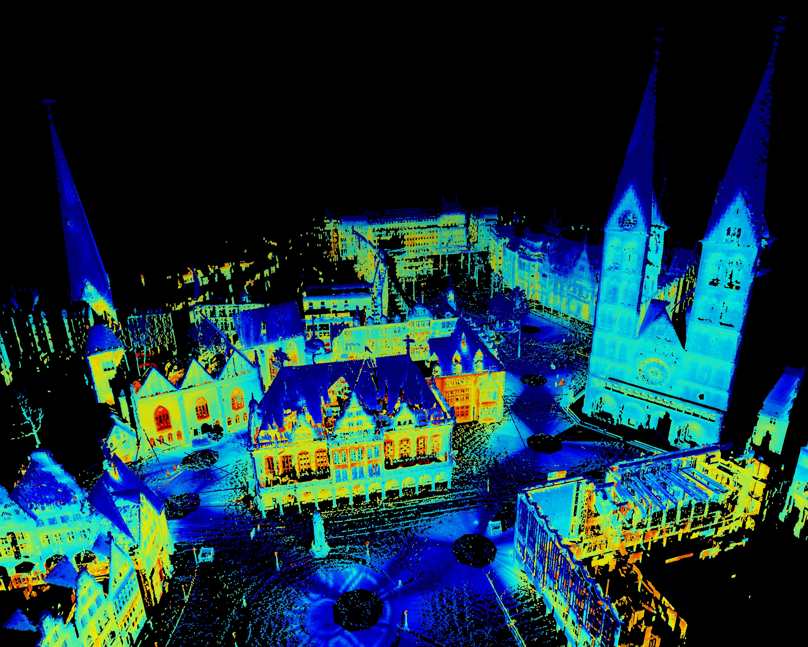

2. What is Computer Vision?
===========================

.. role:: raw-html(raw)
   :format: html

I don't know if you have come across this word - "Computer Vision" earlier, but, I am pretty sure you must have
heard Machine Learning and other buzz words. What exactly is Computer Vision? If I were to explain a 5-year old or a
general population in particular what this is, then I would say -

| *It's the science of making computers intelligent using images and videos*.

Yes, it is a science since there are a lot of algorithms involved and the field is expanding at an
exponential rate. And since we primarily focus on Images and Videos and depth maps, it's called vision, pertaining to
the human visual sensory system. So, now you have a fair idea about what computer vision is in terms of definition.
But, is that all about this field? That doesn't rather cover the entire spectrum of applications! Next up, I would like
to go about some important and specific areas of Computer Vision along with their applications and examples.

   Point Cloud Renders of a Landscape :raw-html:` `
   *credits:* `ComputerVisionOnline <https://computervisiononline.com/sites/default/files/3d-robotics-repository.jpg>`_

.. toctree::
   :maxdepth: 2

   classification/classification
   detection/detection
   segmentation/segmentation
   pose/pose
   captioning/captioning
   synthesis/synthesis