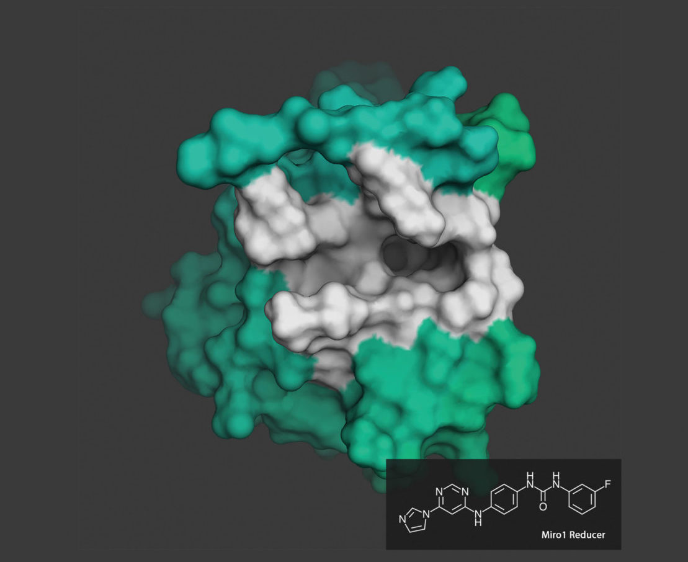

3.3.4 Get insights
==================

.. toctree::
   :maxdepth: 2

.. role:: raw-html(raw)
   :format: html

AI may be used to extract insights from millions of experimental affinity measurements and thousands of protein structures
to predict the binding of small molecules to proteins. Recently, Atomwise developed an algorithm named AtomNet,
a structure-based, deep convolutional neural network designed to predict the bioactivity of small molecules for drug discovery
applications. AtomNet helped Stanford University researchers screen 6.8 million small molecules for their ability to target Miro1,
a protein implicated in Parkinson’s disease. Getting insights into sciences (physical, biological or chemical) can help in better
discovering new drugs and A.I. can help us treat them more efficiently. [1]_ [2]_

   Miro1 Reducer, the compound developed by Atomwise using AtomNet :raw-html:` `
   *credits:* `genengnews <https://www.genengnews.com/insights/trends-for-2020/artificial-intelligence-is-helping-biotech-get-real/>`_

.. rubric:: Citations

.. [1] `https://www.statnews.com/sponsor/2020/07/14/with-ai-we-can-move-into-uncharted-territory-for-drug-discovery-and-solve-the-impossible-targets/ <https://www.statnews.com/sponsor/2020/07/14/with-ai-we-can-move-into-uncharted-territory-for-drug-discovery-and-solve-the-impossible-targets/>`_
.. [2] `https://www.genengnews.com/insights/trends-for-2020/artificial-intelligence-is-helping-biotech-get-real/ <https://www.genengnews.com/insights/trends-for-2020/artificial-intelligence-is-helping-biotech-get-real/>`_
