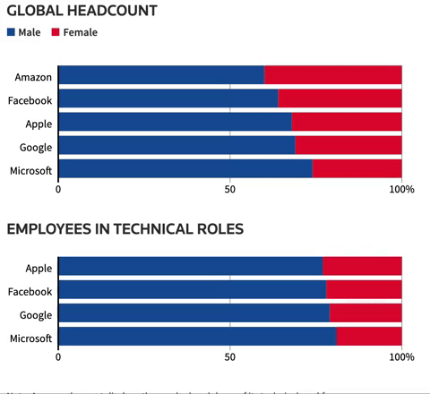
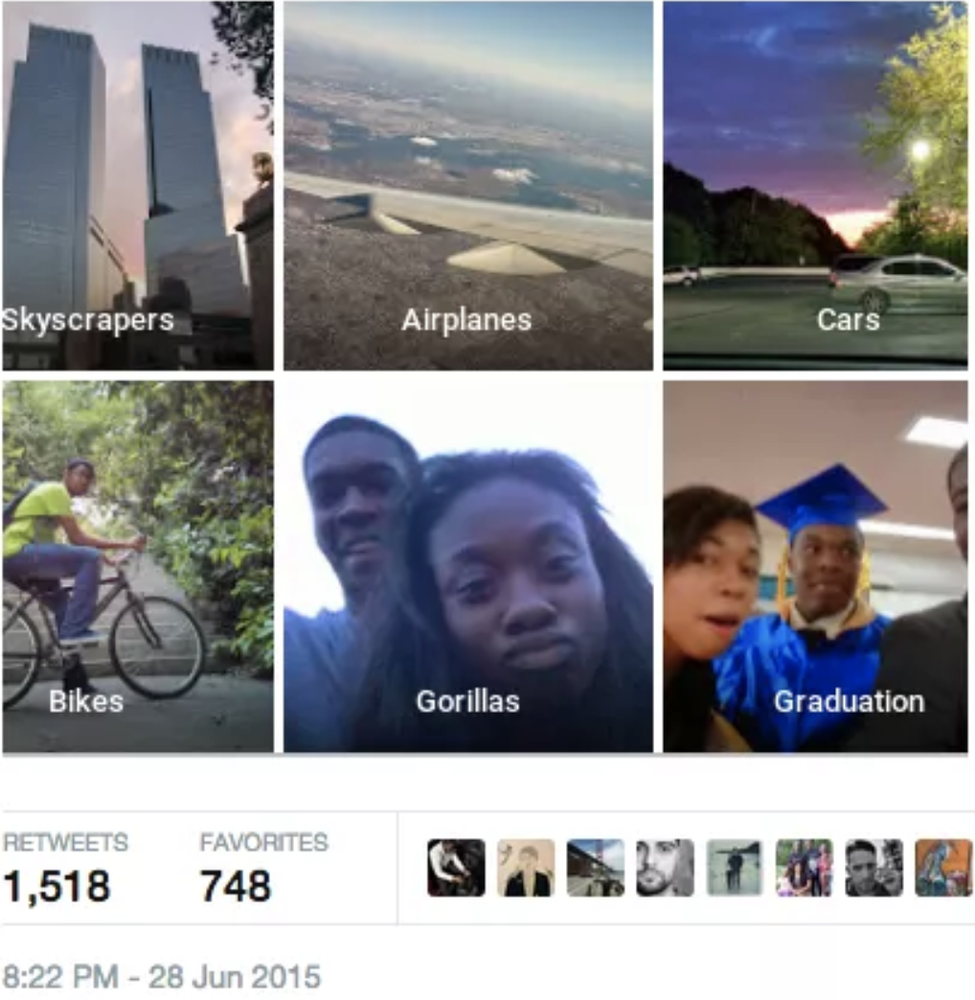

3.3.2 Improve the classifier
============================

.. toctree::
   :maxdepth: 2

.. role:: raw-html(raw)
   :format: html

Just like we would like to verify if our classifier works properly or not so as to avoid any fatal incidents, we would also
like to improve the classifier to work against bias. The more the generalized the solutions are, lesser are the chances of it
affecting human sentiments. [1]_ For instance, Amazon happened to use AI enabled recruiting software for reviewing resumes and make hiring recommendations between 2014
and 2017. The software was found to be gender biased since it favoured male applicants over female applicants. This was because,
the algorithm was trained on resumes submitted to Amazon over the last decade which were predominantly male oriented. The software
downgraded resumes with the word **woman** in their resumes. The company discontinued the use of the software shortly after the
supposed bias in its decision making. [2]_

   Statistic showing natural bias in employees at top tech companies :raw-html:` `
   *credits:* `reuters <https://www.reuters.com/article/us-amazon-com-jobs-automation-insight/amazon-scraps-secret-ai-recruiting-tool-that-showed-bias-against-women-idUSKCN1MK08G>`_

Likewise, in 2015, Google Photos accidentally tagged Black African American people as Gorillas. The algorithms automatically
grouped photos of the user and since it wasn't trained on recognizing black African American people, it misclassified them
with the nearest possible prediction - the Gorillas. This is racial bias induced in the algorithms due to lack of generalization.
This also reminds us to cover a whole spectrum of individual from different ages, culture, languages and ethnicity so as to have
a biased free system. [3]_ [4]_

   Google Photos accidentally labels African-American people as Gorilla :raw-html:` `
   *credits:* `cnet <https://www.cnet.com/news/google-apologizes-for-algorithm-mistakenly-calling-black-people-gorillas/>`_

.. rubric:: Citations

.. [1] `https://www.businessinsider.com/amazon-ai-biased-against-women-no-surprise-sandra-wachter-2018-10 <https://www.businessinsider.com/amazon-ai-biased-against-women-no-surprise-sandra-wachter-2018-10>`_
.. [2] `https://www.inc.com/guadalupe-gonzalez/amazon-artificial-intelligence-ai-hiring-tool-hr.html <https://www.inc.com/guadalupe-gonzalez/amazon-artificial-intelligence-ai-hiring-tool-hr.html>`_
.. [3] `https://www.cnet.com/news/google-apologizes-for-algorithm-mistakenly-calling-black-people-gorillas/ <https://www.cnet.com/news/google-apologizes-for-algorithm-mistakenly-calling-black-people-gorillas/>`_
.. [4] `https://www.theverge.com/2018/1/12/16882408/google-racist-gorillas-photo-recognition-algorithm-ai <https://www.theverge.com/2018/1/12/16882408/google-racist-gorillas-photo-recognition-algorithm-ai>`_
