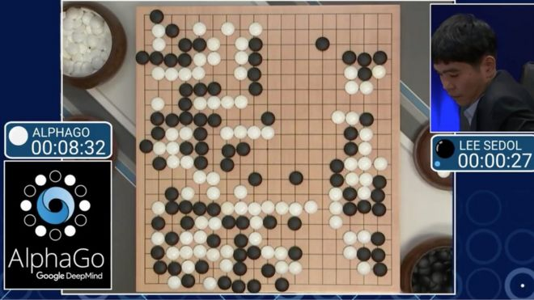

3.3.3 Learn from the algorithm itself about it's decisions
==========================================================

.. toctree::
   :maxdepth: 2

.. role:: raw-html(raw)
   :format: html

Interpretability can help humans to learn from machines too. In 2016, AlphaGo played a mysterious move against Lee Sedol,
the world's top player for AplhaGo, which completely stunned everyone. The move didn't make sense to any human present in
the room. [1]_

| **That's a very strange move! I thought maybe it was a mistake.** - *Lee Sedol*

Three times European Go Champion, Fan Hui was gobsmacked by the move too.

| **It's not a human move, I have never seen a human play the move like this! So beautiful!** - *Fan Hui*

   Google DeepMind AlphaGo vs Lee Sedol :raw-html:` `
   *credits:* `bbci <https://ichef.bbci.co.uk/news/660/cpsprodpb/11B23/production/_88738427_pic1go.jpg>`_

This historic incident concludes that human can learn from machines too provided we know how the system works and and reason
for its success. In areas like Reinforcement Learning, interpretability can help a lot in understanding the decisions made by
algorithms.

.. raw:: html

  

     <iframe src="https://www.youtube.com/embed/Lu56xVlZ40M" frameborder="0" allowfullscreen style="position: absolute; top: 0; left: 0; width: 100%; height: 100%;"></iframe>
  
 
  
RL based Hide-and-Seek Game by OpenAI

  
<i>credits: </i><a href="https://www.linkedin.com/in/menessert?miniProfileUrn=urn%3Ali%3Afs_miniProfile%3AACoAABuPR8sBgox3j84XgIsQ9zU2LPa-luNq87o&lipi=urn%3Ali%3Apage%3Ad_flagship3_search_srp_content%3B4VIW%2BMF1QLOIyCSAzM5O%2FQ%3D%3D&licu=urn%3Ali%3Acontrol%3Ad_flagship3_search_srp_content-actor_container&lici=WzFSbLwSQGabi%2F8P3OPoKA%3D%3D">linkedin</a>

Recently, OpenAI released a clever hide and seek game based on 2 teams of baby RL agents. One of the team needs
to find the next team. The arena has random objects placed. Through Reinforcement Learning, the agents learned to exploit the objects
by moving them and made use of physics during their time in the game. Most of the moves we not taught to the agent and through self
understanding and learning, it learnt to exploit the bugs in the game and break the rules. [2]_

.. rubric:: Citations

.. [1] `https://www.wired.com/2016/03/googles-ai-viewed-move-no-human-understand/ <https://www.wired.com/2016/03/googles-ai-viewed-move-no-human-understand/>`_
.. [2] `https://techcrunch.com/2019/09/17/clever-hide-and-seek-ais-learn-to-use-tools-and-break-the-rules/ <https://techcrunch.com/2019/09/17/clever-hide-and-seek-ais-learn-to-use-tools-and-break-the-rules/>`_
