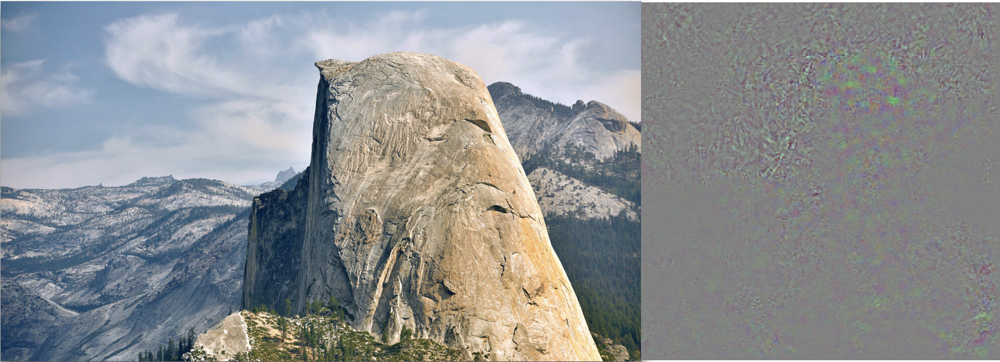
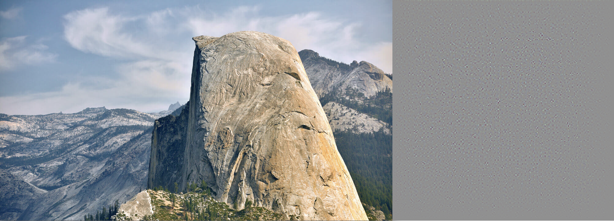
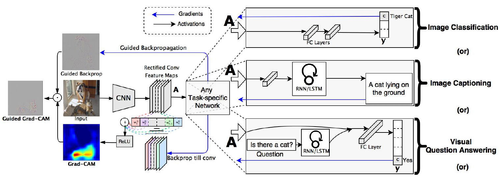
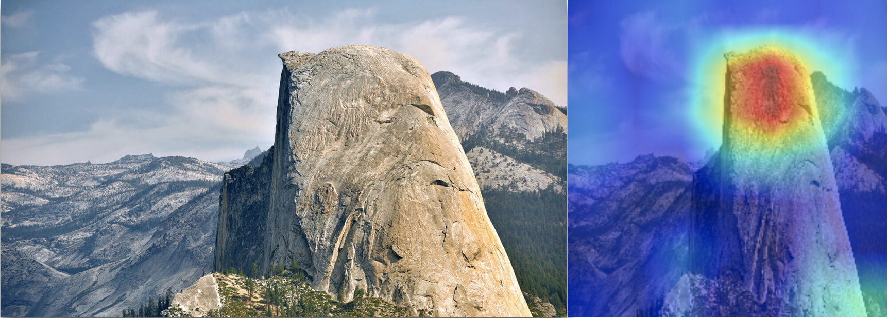

4.1 Grad-CAM
============

.. toctree::
   :maxdepth: 2

.. role:: raw-html(raw)
   :format: html

Deep Neural Networks are hard to interpret and this leads to black box models. These models are highly discriminative in
nature and perform as good as humans in various tasks from classification to visual question answering to captioning an
image. Grad-CAM (Gradient weighted Class Activation Mapping) is a technique which gives visual
explanations for decisions made by deep neural networks on large scale datasets like PASCAL, IMAGENET, Places365, COCO,
etc. Grad-CAM uses gradient of any target concept flowing into the final convolutional layer and produces coarse localization.

Examples of targets can be dogs, cats or any other class we intend to predict. The proposed technique can be applied to
a wide variety of problems – Image classification, image captioning, visual question answering, reinforcement learning.
Unlike CAM (the algorithm from which Grad-CAM is inspired from), no architectural changes are required on existing models;
and we also do not have to worry about re-training the entire model for interpretability purposes. This is particularly advantageous in case of
image classification tasks since – it lends insights into failure nodes of the model, it outperforms previous methods,
it is robust to perturbations, it helps generalize dataset bias and lastly it helps in generating more faithful models.
Grad-CAM also helps non-attention (a type of identification concept or principle where in important parts of the images
are attended in order to come up with a decision) based models to learn to localize discriminative regions in an image
in the case of image captioning and visual question answering tasks. More specifically they can identify important neurons
to provide textual explanations for model decisions in case of image captioning and visual question answering tasks.
Since models lack interpretability, individual components are not intuitive enough for self-interpretation and if they
fail, they do so miserably without any explanation. Hence, narrowing down on the exact cause for failure of models can
be a hard thing to achieve without interpretability methods like Grad-CAM. Our models should explain why they predict
what they predict and that's why Grad-CAM can be beneficial. There always exists a trade off between accuracy and simplicity
(interpretability).

**Interpretability helps at 3 stages:** :raw-html:` `
1. When AI is weaker than humans and not ready for the real world (VQA), it can help to identify failure nodes, focusing
our effort on more important stuff. :raw-html:` `
2. When AI is at par with humans and deployable (image classification), it helps establish trust and confidence among users. :raw-html:` `
3. When AI is significantly stronger than humans (AlphaGo), machines can teach humans how to make better decisions.

What makes a good visual explanation? It should be discriminative in nature and it should be high resolution
(have fine grained information). Prior to Grad-CAM there existed methods like - Pixel wise gradient visualizations like
Guided Backpropagation and Deconvolution which were high in resolution, but were less discriminative in nature.

   Original image on left vs vanilla backpropagation visualization on right :raw-html:` `

   Original image on left vs Deconvolution visualization on right :raw-html:` `

Approaches like CAM or Grad-CAM are discriminative due to high localization capabilities, but aren't as high in
resolution as Guided Backpropagation and Deconvolution. To account for this, a fusion of both the above methods lead to
the creation of Guided Grad-CAM. Guided Grad-CAM gives the best of both worlds with localization for discriminative
behavior along with fine grained visualizations (high resolution). Important regions are highlighted even if image has
multiple concepts.

   Grad-CAM Architecture :raw-html:` `

Convolution Neural Networks have the natural capability to retain spatial information and the last convolutional layer
has class specific semantic information apart from higher level pixel feature information. Therefore, Grad CAM uses
gradient information flowing from the last convolutional layer to assign importance to each neuron for particular
decisions. Grad-CAM focuses on explaining output layer decisions only (as mentioned in the paper). Guided Backpropagation
visualizes gradients with respect to image and it has a special property where negative gradients are suppressed when
passing through RELU layers. This causes only those pixels to stand out which were detected by neurons and not the ones
which were suppressed by neurons.

On the contrary, Grad-CAM visualizations are more interpretable through correlation
with occlusion maps. Another important drawback of deep Neural Networks are its vulnerability to adversarial noise.
Grad-CAM is robust to adversarial noise. Grad-CAM also helps detect and remove bias in datasets. For instance, if a
dataset has a large number of images of female nurses and doctors, it can help us figure out why the output was a nurse
or a doctor. Was the network focussing on the facial features for its prediction or was it attending to other important
features like stethoscope or type of clothes, etc. In Grad-CAM, neurons act as concept detectors in a Convolutional
Neural Network as mentioned in literature. Higher positive values of neuron importance indicate that the concept is
present in the image and it leads to a higher class score; whereas higher negative value indicates that the concept is
absent in the image, which further leads to decrease in class score.

   Original Image vs Grad-CAM visualization :raw-html:` `

This is used in visual question answering tasks where top 5 concepts are positively weighted by the neuron if they exist
in the image, and conversely the negative concepts which don’t exist in the image are also weighted. Grad-CAM can localize regions of the image which the DenseCap
model describes and this helps in understanding and interpreting captioning tasks. Furthermore, with weakly supervised
segmentation tasks, where the idea is to segment objects in an image, Grad-CAM can help to visualize the feature maps
which helps interpretability in Image Segmentation tasks.

In summary, Grad-CAM can be used to get visual as well as textual explanations for complex deep neural networks without
any architectural changes and it tackles many problems of computer vision domain.
