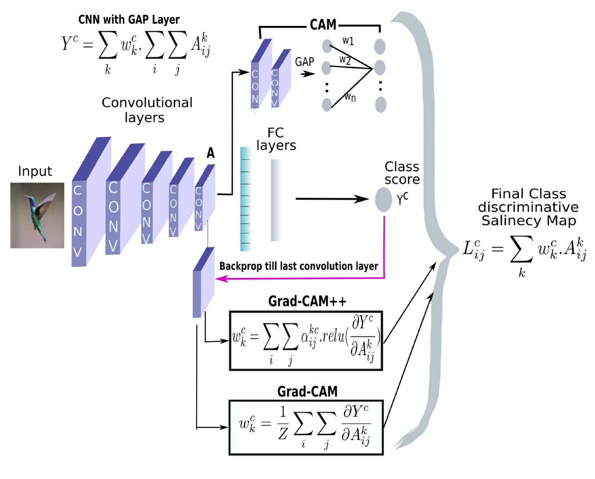
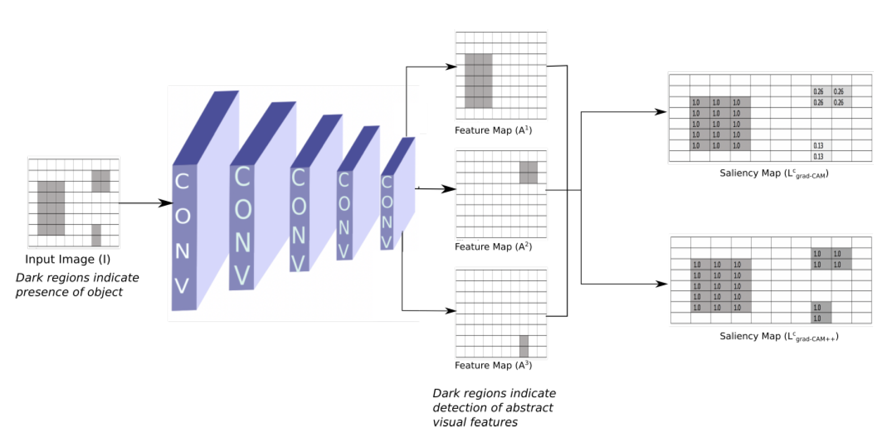
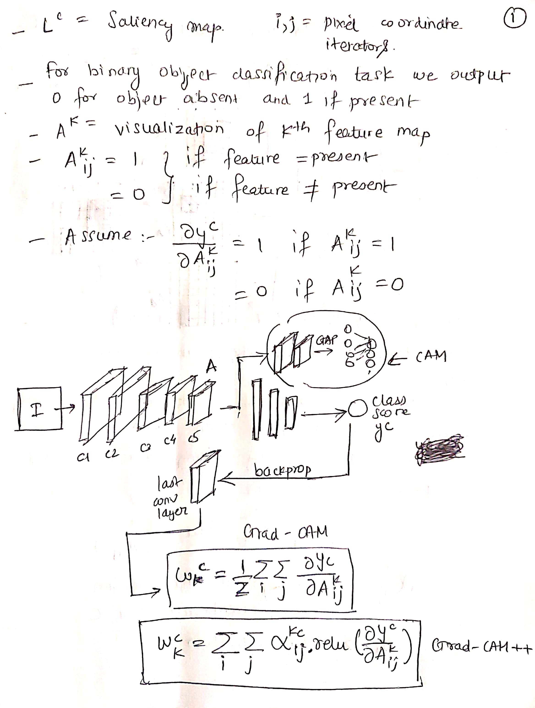
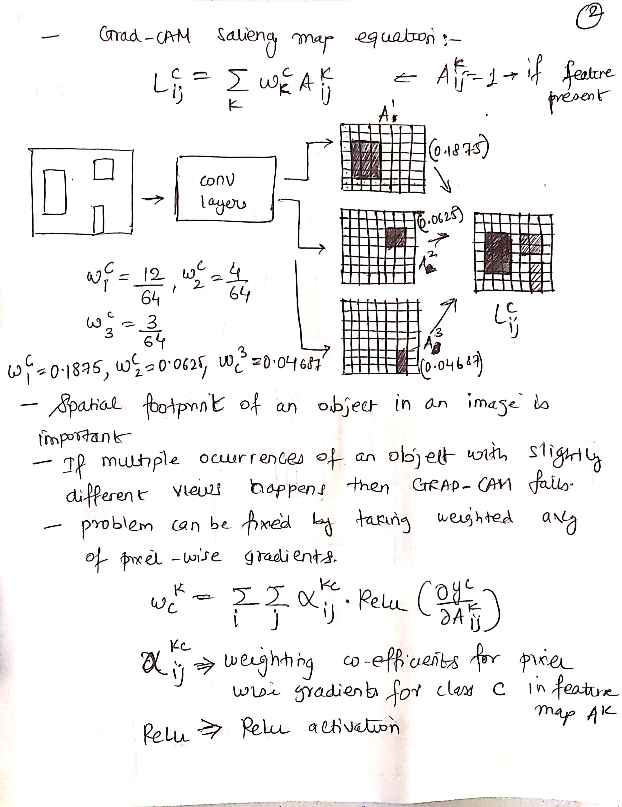
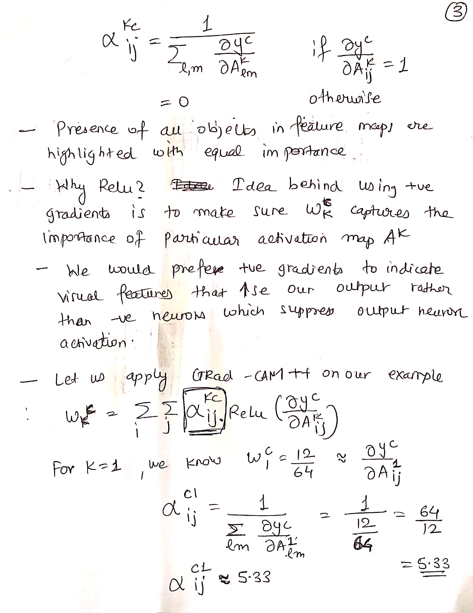
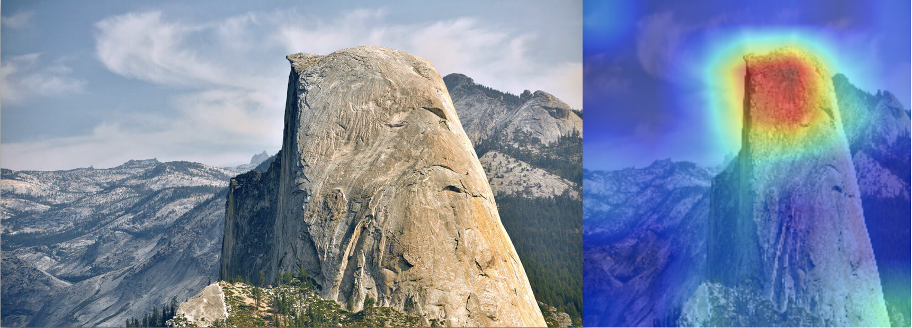

5.2 Grad-CAM++
==============

.. toctree::
   :maxdepth: 2

.. role:: raw-html(raw)
   :format: html

Grad-CAM++ is the extension of Grad-CAM which we observed earlier. Grad-CAM is not good at localizing multiple objects in images
belonging to the same class. For multiple object images, Grad-CAM do not capture the object in it’s entirety. This is required for better
recognition tasks and hence, Grad-CAM++ fills for these caveats.

   Grad-CAM++ Architecture :raw-html:` `

Grad-CAM++ provides pixel-wise weighting of the gradients of the output w.r.t. to the particular spatial position in the
final feature map towards overall decision of the CNN. This provides a measure of importance of each pixel in the feature map
towards overall decision of the CNN.

   Grad-CAM++ Intuition :raw-html:` `

.. admonition:: Note

   Below contains images of math and the underlying logic surrounding Grad-CAM++. Images are uploaded since writing such
   complex math and getting it rendered was difficult. Please bear my hand writing.

   Math Page 1 :raw-html:` `

   Math Page 2 :raw-html:` `

   Math Page 3 :raw-html:` `

.. figure:: ../../../_static/page4.jpg
   :align: center
   :width: 700px

   Math Page 4 :raw-html:` `

   Original Image vs Grad-CAM++ visualization for layer 43 of VGG-16 network :raw-html:` `