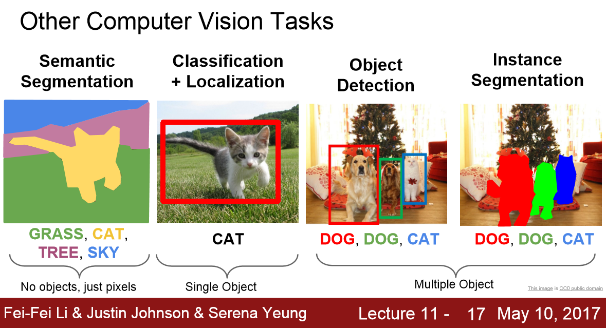

4. Image Segmentation Techniques
================================

.. role:: raw-html(raw)
   :format: html

Deep learning has been very successful when working with images as data and is currently at a stage where it works better
than humans on multiple use-cases. The most important problems that humans have been interested in solving with computer
vision are image classification, object detection and segmentation in the increasing order of their difficulty. [1]_

.. _target:

In image classification we are just interested in getting the labels of all the objects that are
present in an image (the top k objects to be more specific else it usually identifies only 1). In object detection, we
come further a step and try to know along with what all objects that are present in an image, the location at which the
objects are present with the help of bounding boxes. Image segmentation takes it to a new level by trying to find out
accurately the exact boundary of the objects in the image. [1]_

   Image Classification, Object Detection and Segmentation :raw-html:` `
   *credits:* `nanonets <https://nanonets.com/blog/content/images/2020/08/59b6d0529299e.png>`_

In very simple terms, Image Segmentation can be considered as a classification problem where the goal is to classify
each pixel in an image belonging to a certain class, rather than classifying the entire image in itself. In earlier chapters,
we explained briefly what Image Segmentation is, a few real world applications and some limitations of those algorithms.
In this chapter we dwelve deeper into Image Segmentation and specifically explore 2 most widely used Segmentation techniques.
We will cover the algorithms which we used for our experiments and try to give an intuition of how things work under the hood
in a minimal way.

.. toctree::
   :maxdepth: 4

   semantic/semantic
   instance/instance

.. rubric:: Citations

.. [1] `https://nanonets.com/blog/semantic-image-segmentation-2020/ <https://nanonets.com/blog/semantic-image-segmentation-2020/>`_

