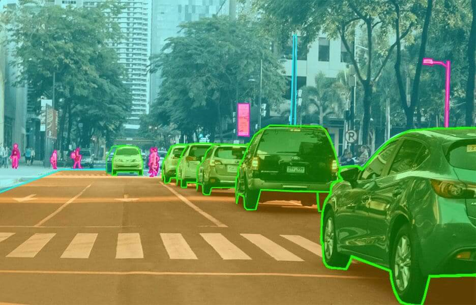
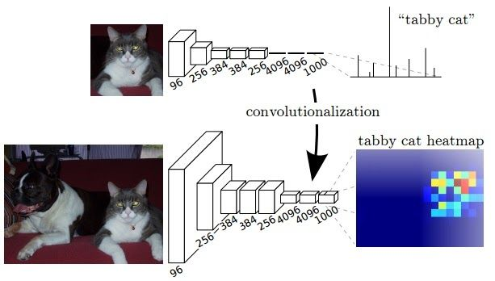
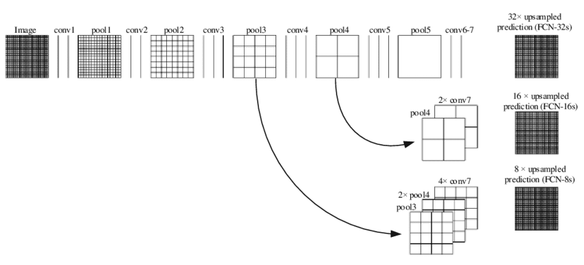
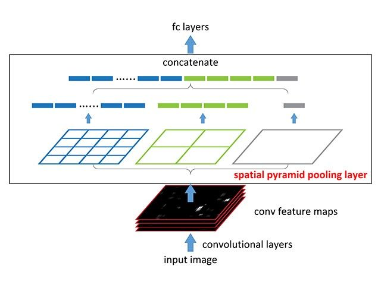
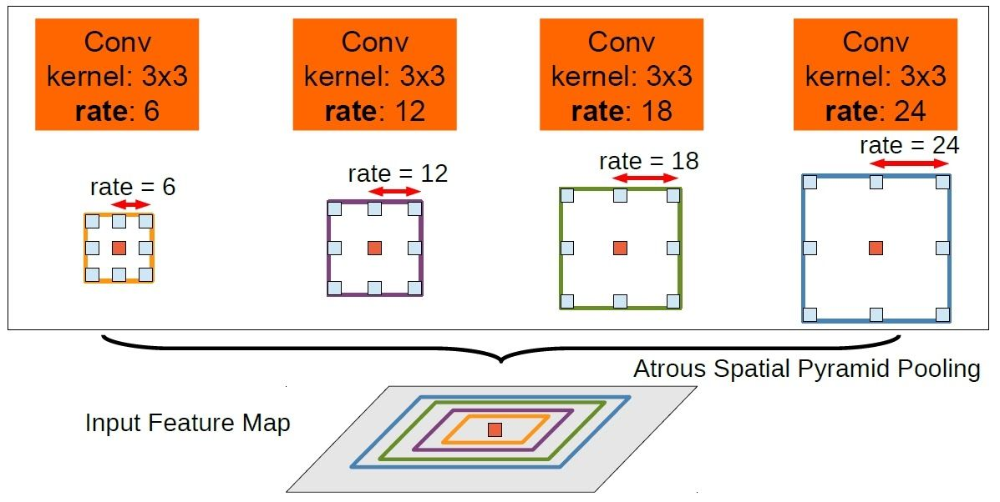
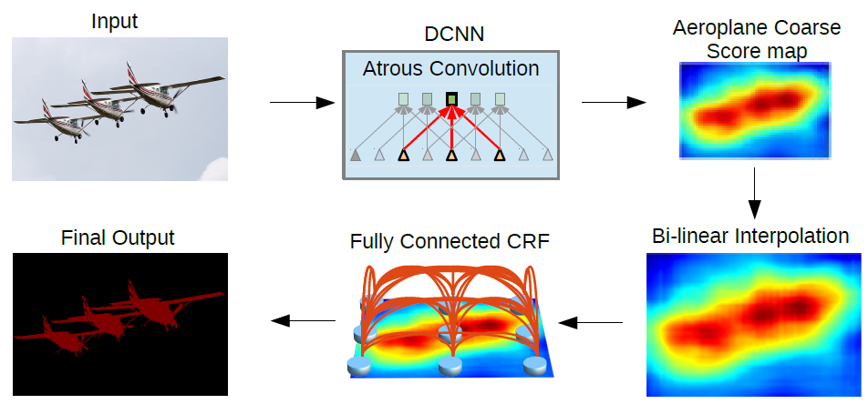
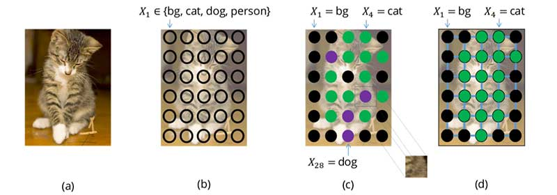
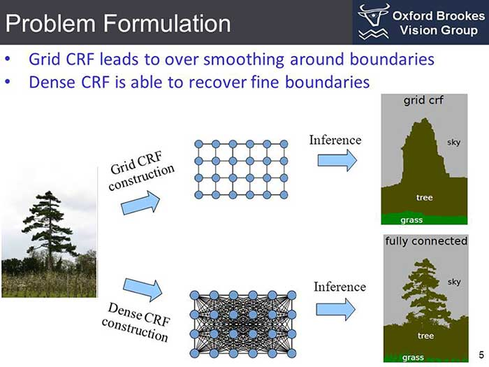
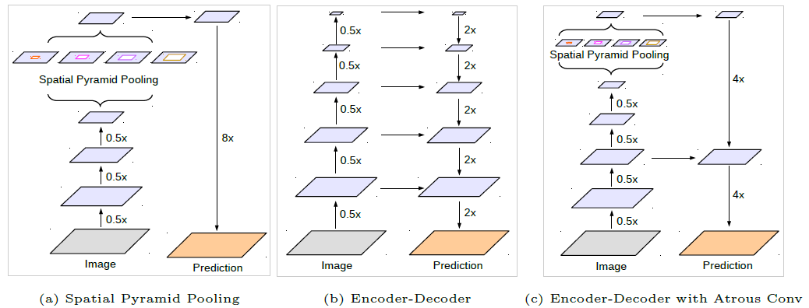

4.1 Semantic Segmentation
=========================

.. toctree::
   :maxdepth: 2

.. role:: raw-html(raw)
   :format: html

4.1.1 Intuition behind Semantic Segmentation
--------------------------------------------

Semantic segmentation is one of the key problems in the field of computer vision. From a big picture point of view, semantic
segmentation is one of the high-level task that paves the way towards complete scene understanding. The importance of
scene understanding is as a core computer vision problem. With the popularity of deep learning in recent years, many semantic segmentation problems
are being tackled using deep architectures, most often using Convolutional Neural Nets, which surpass other approaches by a
large margin in terms of accuracy and efficiency. [1]_

   Example of Semantic Segmentation :raw-html:` `
   *credits:* `cogitotech <https://www.cogitotech.com/wp-content/uploads/2019/11/segmentation.jpg>`_

Semantic segmentation is the process of classifying each pixel to a particular label. It doesn't differentiate
between different instances of the same object. For example if there are 2 cats in an image, semantic segmentation gives
same label to all the pixels of both cats. For Semantic Segmentation, multiple instances of same class are not different.
This makes sense, since the underlying logic is  **Classification + Localization = Semantic Segmentation**. Consider
above image too, for instance. There are multiple cars and people, but all are represented by the same mask.

It helps us migrate from coarse to fine inference. Originally, we have classification, which consists of making a
prediction for a whole input image. We then perform localization / detection, which provides not only the classes
but also additional information regarding the spatial location of those classes. Recall, we earlier mentioned about localization
as the capability of an algorithm to figure out location of an object in an image. By spatial location we mean **localization**.
Finally, semantic segmentation helps us achieve fine-grained inference by making dense predictions, essentially inferring labels for every pixel,
so that each pixel is labeled with the class of its enclosing object as region. [2]_

4.1.2 Algorithms for Semantic Segmentation
------------------------------------------

Before deep learning, classical machine learning techniques like SVM, Random Forest, K-means Clustering were used to
solve the problem of image segmentation. More recently, deep learning based approaches have shown far better accuracy
in performing Semantic Segmentation then earlier classical approaches and have become the gold standard for segmentation
related problems. In this work, we will understand FCN (Full Convolutional Networks) and DeepLab (company founded by
group of researchers from Google) developed architectures like Atrous Convolution, Atrous Spatial Pyramid Pooling (ASPP)
and Conditional Random Field (CRF) based Atrous Convolution (DeepLab-v3). We will explore this 4 architectures since we used
them for our work.

4.1.2.1 Fully Convolutional Networks (FCN)
^^^^^^^^^^^^^^^^^^^^^^^^^^^^^^^^^^^^^^^^^^

A typical CNN consists of few convolutional and pooling layers followed by few fully connected layers at the end.
Fully Convolutional Network released in 2014, argues that the final fully connected layer can be thought of as doing a
1x1 convolution that cover the entire region. Replacing the final dense layers by a convolution layer helps in achieving
the same result. But now the advantage of doing this is the size of input need not be fixed anymore. When involving dense
layers the size of input is constrained and hence when a different sized input has to be provided it has to be resized.
Recall, for classic CNN based architectures, the input size had to be fixed to either 227x227 or 224x224, however, a
simple modification like above makes the network agnostic when it comes to inputs of variable sizes. Simply by replacing
a dense layer with convolution, this constraint doesn't exist anymore. [1]_

   Fully Convolutional Network vs the Traditional CNN :raw-html:` `
   *credits:* `nanonets <https://nanonets.com/blog/content/images/2020/08/FCN.jpg>`__

When a bigger size of image is provided as input the output produced will be a feature map and not just a class output.
Also the observed behavior of the final feature map represents the heatmap of the
required class i.e the position of the object is highlighted in the feature map. Since the output of the feature map is
a heatmap of the required object it is valid information for our use-case of segmentation. This idea is contrastive in
nature to how classification networks work. This very idea is an important point which we will touch on later in the book.
As with classification networks trained on say, IMAGENET-1000, our classifier gives us probability scores of the most
probable class predicted given an image. For a segmentation network, just by having convolutional layers instead of dense
layers, we get a spatial feature map which coarsely highlights the desired object in the image.

.. admonition:: Note

   Classification based algorithms have Fully Connected Layers often called **Dense Layers** after the convolutional
   layers. These dense layers give out a probability score vector by a Softmax Function. The probability score vector denotes the
   probability of each class given an image. However, Segmentation based algorithms **don't** have Dense layers. They instead
   have convolutional layers with 1x1 blocks, hence called Fully Convolutional Layers (FCNs). They output a 2D feature map
   instead of a 1D probability vector and therefore do not have a softmax function.

Since the feature map obtained at the output layer is a down sampled due to the set of convolutions performed, we would
want to up-sample it using an interpolation technique. Bilinear up sampling works, however, up sampling with deconvolution
can be used. The down sampling part of the network is called an **encoder** and the up sampling part is called a **decoder**.

The function of the encoder (as the name means literally), is to encode information so as to represent it with the least
amount of bits (only those which are totally relevant). I will not be diving deeper into information theory, but the basic
principle is, everything boils down to bits eventually. If an event is occurring many times, information of that event is
represented by fewer bits and for an anomaly or a rare event, the information is represented by many bits. The goal of the
encoder is to encode a high dimensional image, into a low dimensional latent space which contains only the most relevant information.
On the contrary, decoder, is to extract information from a cryptic code, much like decoding a secret message (where a lot of information
is put into few symbols). The latent space needs to be now converted into the same dimension as the input. Decoder helps you
achieve that goal. This process is called **reconstruction**, **up-sampling** or **deconvolution** (as it performs exactly the
opposite function of convolution). Such encoder-decoder patterns are present in many architectures, where we reduce the size with
encoder and then up sample with decoder. As we already know, pooling helps to reduce our feature map size and is used widely to
reduce the number of parameters present in the network. The cost of computation is significantly reduced due to pooling but not
without significant information loss.

   Logic Behind FCN Networks :raw-html:` `
   *credits:* `nanonets <https://nanonets.com/blog/content/images/2020/08/Visualization-of-FCN-32s-FCN-16s-and-FCN-8s-architectures-20.png>`__

The feature maps given out by the Fully Connected Network (FCN) are coarse and rough in nature. The reason for this is
loss of information at the final feature layer due to downsampling by 32 times using convolution layers. Now it becomes very
difficult for the network to do 32x upsampling by using this little information. This architecture is called FCN-32.
If you observe in the above figure, we have 5 pooling layers, each performing a 2x2 down-sampling pooling convolution operation.
After going through 5 of those layers, the image is downsampled by 2^5 = 32x. Up-sampling an image which is shrunk by 32x
is very difficult especially reconstructing the masks with smooth contours.

To address this issue, 2 other architectures FCN-16 and FCN-8 we introduced (as shown in above figure). In FCN-16 information
from the previous pooling layer is used along with the final feature map and hence now the task of the network is to learn 16x up sampling which is better
compared to FCN-32. Since, information from the 4th pooling layer is used directly (much like the shortcut connection in ResNets),
we only have to account for 4 pooling layers for information loss, therefor, 2^4 = 16x up-sampling needs to be performed.
Likewise, FCN-8 tries to make it even better by including information from one more previous pooling layer. Since 2 previous layers,
pass on information to the final layer for reconstruction, only 3 pooling layers needs to be accounted for up-sampling, therefore, only
2^3 = 8x up-sampling needs to be done.

4.1.2.2 Atrous Convolution
^^^^^^^^^^^^^^^^^^^^^^^^^^

One of the major problems with FCN approach is the excessive downsizing due to consecutive pooling operations. As observed in
Fully Convolutional Network (FCN), inputs can get down sampled by a maximum factor of 32x. This leads to a significant loss of
information which is very crucial for getting fine output in a segmentation task. Additionally, deconvolution operation is
computational and memory expensive, since there are additional parameters involved in forming a learned up-sampling framework.

Atrous convolution or the hole convolution or dilated convolution helps in getting an understanding of large context (more spatial area)
using the same number of parameters. The intuition behind Atrous Convolution can be observed below. [2]_

   Fully Convolutional Network vs the Traditional CNN :raw-html:` `
   *credits:* `nanonets <https://nanonets.com/blog/content/images/2020/08/FCN.jpg>`__

Dilated convolution works by increasing the size of the filter by appending zeros(called holes) to fill the gap between parameters.
The number of holes/zeroes filled in between the filter parameters is called by a term dilation rate. When the rate is equal to 1
it is normal convolution. When rate is equal to 2, one zero is inserted between every other parameter making the filter look like a
5x5 convolution (as shown above). Now it has the capacity to get the context of 5x5 convolution while having 3x3 convolution parameters.
Similarly for rate 3 the receptive field goes to 7x7. [2]_

In Deeplab, last pooling layers are replaced to have stride of 1 instead of 2, thereby keeping the down sampling rate to only 8x.
Then a series of Atrous Convolutions are applied to capture the larger context. For training, the output labelled mask is down
sampled by 8x to compare each pixel. For inference, bilinear up-sampling is used to produce output of the same size which gives
decent enough results at lower computational/memory costs since bilinear up sampling doesn't need any parameters as opposed to
deconvolution for up sampling.

4.1.2.3 Atrous Spatial Pyramid Pooling (ASPP)
^^^^^^^^^^^^^^^^^^^^^^^^^^^^^^^^^^^^^^^^^^^^^

Spatial Pyramidal Pooling is a concept introduced in SPPNet to capture multi-scale information from a feature map. Before
the introduction of SPP, input images at different resolutions were supplied and the computed feature maps were used together
to get the multi-scale information. However, this was computationally expensive with higher time complexity. With Spatial Pyramidal Pooling,
multi-scale information can be captured with a single input image. [2]_

   Concept behind Spatial Pyramid Pooling :raw-html:` `
   *credits:* `nanonets <https://nanonets.com/blog/content/images/2020/08/sppnet.jpg>`__

With the SPP module the network produces 3 outputs of dimensions 1x1 (Global Average Pooling), 2x2 and 4x4. These values are concatenated by converting
to a 1d vector, thus capturing information at multiple scales. Another advantage of using SPP is input images of any size can be provided.
ASPP takes the concept of fusing information from different scales and applies it to Atrous convolutions. The input is convolved with different
dilation rates and the outputs of these are fused together. [2]_

   Atrous Spatial Pyramid Pooling Intuition :raw-html:` `
   *credits:* `nanonets <https://nanonets.com/blog/content/images/2020/08/sppnet.jpg>`__

As can be seen, the input is convolved with 3x3 filters of dilation rates 6, 12, 18 and 24 and the outputs are concatenated
together since they are of same size. A 1x1 convolution output is also added to the fused output. To also provide the global
information, the GAP output is also added to above after up sampling. The fused output of 3x3 varied dilated outputs, 1x1 and
Global Average Pooling (GAP) output is passed through 1x1 convolution to get to the required number of channels. Since the
required image to be segmented can be of any size in the input the multi-scale information from ASPP helps in improving the results.

4.1.2.4 Conditional Random Field (CRF) based Atrous Convolution (DeepLab-v3)
^^^^^^^^^^^^^^^^^^^^^^^^^^^^^^^^^^^^^^^^^^^^^^^^^^^^^^^^^^^^^^^^^^^^^^^^^^^^

Pooling is an operation which helps in reducing the number of parameters in a neural network but it also brings a property
of invariance along with it. Invariance is the quality of the neural network of being unaffected by slight translations in input.
Due to this property obtained with pooling, the segmentation output obtained by a neural network is coarse and the boundaries
are not concretely defined. We want the invariance in the images to be captured as well. [2]_

   Conditional Random Field (CRF) based Atrous Convolution, aka DeepLab-v3 :raw-html:` `
   *credits:* `nanonets <https://nanonets.com/blog/content/images/2020/08/1_MVLmei6xOqScKjwffk4ZXg.png>`__

To deal with this, a graphical model named **Conditional Random Field (CRF)** was introduced.

4.1.2.4.1 What are Conditional Random Fields?
"""""""""""""""""""""""""""""""""""""""""""""

Consider segmenting an image by training a model to assign a class per pixel. In case our model is not perfect, we may
obtain noisy segmentation results that may be impossible in nature (such as dog pixels mixed with cat pixels, as shown below).
These can be avoided by considering a prior relationship among pixels, such as the fact that objects are continuous and hence
nearby pixels tend to have the same label. To model these relationships, we use Conditional Random Fields (CRFs). [3]_

   Challenges faced by Segmentation Networks without CRF. :raw-html:` `
   *credits:* `topbots <https://www.topbots.com/wp-content/uploads/2019/05/pixels_with_label_800px_web.jpg>`__

CRFs are a class of statistical modelling methods used for structured prediction. Unlike discrete classifiers, CRFs can
consider *“neighboring context”* such as relationship between pixels before making predictions. This makes it an ideal
candidate for semantic segmentation. It operates as a post-processing step and tries to improve the results produced to
define sharper boundaries. It works by classifying a pixel based not only on it's label but also based on other pixel labels.
As can be seen from the below figure, the coarse boundary produced by the neural network gets more refined after passing through CRF. [2]_

   Grid CRF vs Dense CRF :raw-html:` `
   *credits:* `topbots <https://www.topbots.com/wp-content/uploads/2019/05/problem_formulation_700px_web.jpg>`__

Each pixel in the image is associated with a finite set of possible states. In our case, the target labels are the set of
possible states. The cost of assigning a state (or label, u) to a single pixel (x) is known as its unary cost. To model
relationships between pixels, we also consider the cost of assigning a pair of labels (u,v) to a pair of pixels (x,y) known as
the pairwise cost. We can consider pairs of pixels that are its immediate neighbors (Grid CRF) or we can consider all pairs
of pixels in the image (Dense CRF). The sum of the unary and pairwise cost of all pixels is known as the energy (or cost/loss)
of the CRF. This value can be minimized to obtain a good segmentation output. [3]_

Now that we know what Conditional Random Fields (CRFs) are, let us understand its relation with Atrous Convolution.
Deeplab-v3 introduces batch normalization and suggested dilation rate multiplied by (1,2,4) inside each layer in a Resnet block.
Likewise, in Deeplab-v3+, we have a decoder instead of a plain bilinear 16x up-sampler. This decoder takes inspiration from the decoder
used by architectures like U-Net, (where information from encoder layers are used to improve the results). The encoder output is up-sampled
4x times using bilinear up-sampling and concatenated with the features from encoder which is again up sampled 4x times after
performing a 3x3 convolution. This approach yields better results than a direct 16x up-sampling. Also modified Xception
architecture is proposed to be used instead of ResNet as part of encoder and depth-wise separable convolutions are now used on
top of Atrous convolutions to reduce the number of computations.

   DeepLab-v3+ using the encoder-decoder architecture :raw-html:` `
   *credits:* `nanonets <https://nanonets.com/blog/content/images/2020/08/1_Llh9dQ1ZMBqPMOJSf7WaBQ.png>`__

4.1.3 Our Observations for Semantic Segmentation
------------------------------------------------

.. rubric:: Citations

.. [1] `https://nanonets.com/blog/how-to-do-semantic-segmentation-using-deep-learning/ <https://nanonets.com/blog/how-to-do-semantic-segmentation-using-deep-learning/>`_
.. [2] `https://nanonets.com/blog/semantic-image-segmentation-2020/ <https://nanonets.com/blog/semantic-image-segmentation-2020/>`_
.. [3] `https://www.topbots.com/semantic-segmentation-guide/ <https://www.topbots.com/semantic-segmentation-guide/>`_

