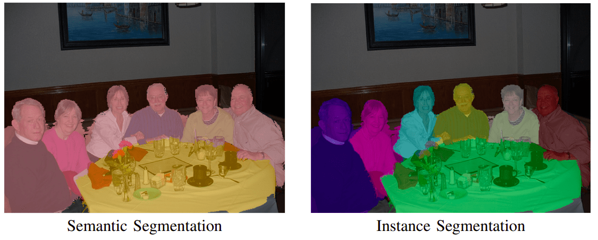
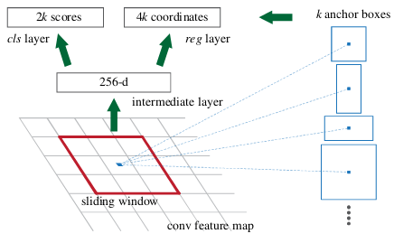
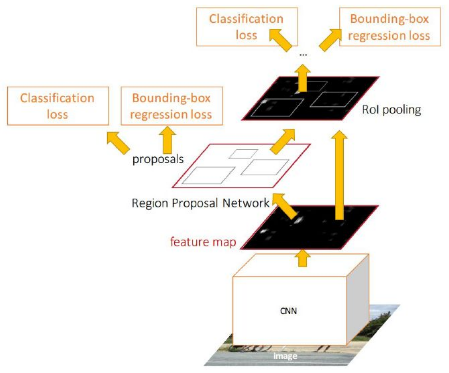
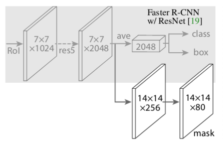
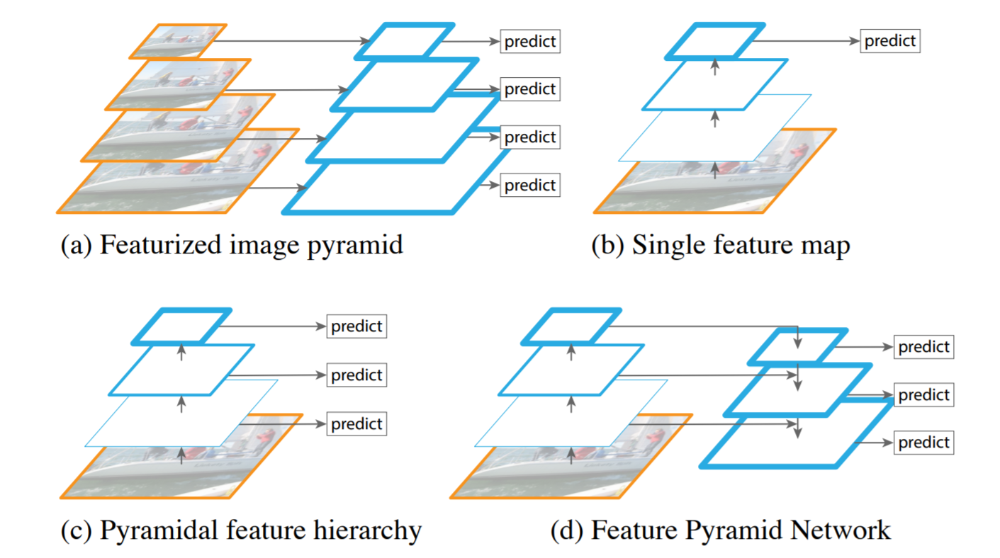

4.2 Instance Segmentation
=========================

.. toctree::
   :maxdepth: 2

.. role:: raw-html(raw)
   :format: html

4.2.1 Intuition behind Instance Segmentation
--------------------------------------------

Instance segmentation combines object detection, where the goal is to classify individual objects and localize them using
a bounding box, and semantic segmentation, where the goal is to classify each pixel into the given classes. In instance
segmentation, we care about detection and segmentation of the instances of objects separately. [1]_ Unlike, Semantic Segmentation,
Instance Segmentation detects multiple instances of the same class and masks them separately. Moreover,
**Object Detection + Semantic Segmentation = Instance Segmentation**. Recall, this :ref:`figure <target>` show earlier.

.. admonition:: Note

   Classification + Localization = **Semantic Segmentation** :raw-html:` `
   Object Detection + Semantic Segmentation = **Instance Segmentation**

If there are multiple people in an image, instance segmentation will mask each vehicle uniquely, unlike semantic segmentation.
The way it does is by first identifying the objects in the image and getting a bounding box around it. These individual instances
can then be segmented once we get to know their relative location. Consider the below image for the difference.

   Instance Segmentation Example :raw-html:` `
   *credits:* `neptune <https://i2.wp.com/neptune.ai/wp-content/uploads/semantic_vs_instance.png?ssl=1>`_

4.2.2 Algorithms for Instance Segmentation
------------------------------------------

Since Instance Segmentation is derived from Semantic Segmentation, it has the same set of classic algorithms as its
precursors. Currently, Mask RCNN is the state-of-the art algorithm for Instance Segmentation. It extends one of the best
algorithm for Object Detection, i.e Faster-RCNN, by adding parallel branching for predicting segmentation masks. We
will explore 3 architectures - Faster RCNN, Mask RCNN and Feature Pyramid Networks (FPN) since we used them in our work.

4.2.2.1 Faster R-CNN
^^^^^^^^^^^^^^^^^^^^

Faster R-CNN consists of 2 stages.

**Stage 1**

The first stage is a deep convolutional network with Region Proposal Network (RPN), which proposes regions of interest (ROI)
from the feature maps output by the convolutional neural network i.e. the input image is fed into a CNN (often called backbone)
which is usually a pretrained network such as ResNet101. The classification (fully connected) layers from the backbone network
are removed so as to use it as a feature extractor. This also makes the network fully convolutional, thus it can take any input size image.

The RPN uses a sliding window method to get relevant anchor boxes (the precalculated fixed sized bounding boxes having different
sizes that are placed throughout the image that represent the approximate bbox predictions so as to save the time to search) from
the feature maps.

   Intuition behind Faster RCNN :raw-html:` `
   *credits:* `kharshit <https://kharshit.github.io/img/rpn.png>`__

It then does a binary classification that the anchor has object or not (into classes fg or bg), and bounding box regression
to refine bounding boxes. The anchor is classified as positive label (fg class) if the anchor(s) has highest Intersection-over-Union (IoU)
with the ground truth box, or, it has IoU overlap greater than 0.7 with the ground truth.

At each sliding window location, a number of proposals (max k) are predicted corresponding to anchor boxes. So the reg layer
has 4k outputs encoding the coordinates of k boxes, and the cls layer outputs 2k scores that estimate probability of object or
not object for each proposal. In Faster R-CNN, k=9 anchors representing 3 scales and 3 aspect ratios of anchor boxes are present at each sliding window position. Thus, for a convolutional feature map of a size W×H (typically∼2,400), there are WHk anchors in total.

   Architecture of Faster RCNN Network :raw-html:` `
   *credits:* `kharshit <https://kharshit.github.io/img/faster_rcnn.png>`__

Hence, at this stage, there are two losses i.e. bbox binary classification loss (L\ :sub:`cls1`), and bbox regression loss (L\ :sub:`bbox1`), The top (positive)
anchors output by the RPN, called proposals or Region of Interest (RoI) are fed to the next stage.

**Stage 2**

The second stage is essentially Fast R-CNN, which using RoI pooling layer, extracts feature maps from each RoI, and performs
classification and bounding box regression. The RoI pooling layer converts the section of feature map corresponding to each
(variable sized) RoI into fixed size to be fed into a fully connected layer.

For example, say, for a 8x8 feature map, the RoI is 7x5 in the bottom left corner, and the RoI pooling layer outputs a fixed
size 2x2 feature map. Then, the following operations would be performed:

1. Divide the RoI into 2x2.
2. Perform max-pooling i.e. take maximum value from each section.

.. figure:: ../../../_static/stage2.gif
   :align: center
   :width: 600px

   Fast-RCNN Intuition :raw-html:` `
   *credits:* `kharshit <https://kharshit.github.io/img/roi_pooling.gif>`__

The fc layer further performs softmax classification of objects into classes (e.g. car, person, bg), and the same bounding
box regression to refine bounding boxes. Thus, at the second stage as well, there are two losses i.e. object classification
loss, for multiple classes (L\ :sub:`cls2`),and bbox regression loss (L\ :sub:`bbox2`)

4.2.2.2 Mask R-CNN
^^^^^^^^^^^^^^^^^^

Mask R-CNN has the identical first stage, and in second stage, it also predicts binary mask in addition to class score and bbox.
The mask branch takes positive RoI and predicts mask using a fully convolutional network (FCN).

In simple terms, Mask R-CNN = Faster R-CNN + FCN :raw-html:` `
Finally, the loss function is: L = (L\ :sub:`cls`) + (L\ :sub:`bbox`) + (L\ :sub:`mask`)

The (L\ :sub:`cls`)((L\ :sub:`cls1`) + (L\ :sub:`cls2`)) is the classification loss, which tells how close the predictions
are to the true class, and (L\ :sub:`bbox`)((L\ :sub:`bbox1`) + (L\ :sub:`bbox2`)) is the bounding box loss, which tells how
good the model is at localization, as discussed above. In addition, there is also (L\ :sub:`mask`), oss for mask prediction,
which is calculated by taking the binary cross-entropy between the predicted mask and the ground truth. This loss penalizes
wrong per-pixel binary classifications (fg/bg w.r.t ground truth label).

   Intuition behind Mask-RCNN Networks :raw-html:` `
   *credits:* `kharshit <https://kharshit.github.io/img/mask_head.png>`__

Mask R-CNN encodes a binary mask per class for each of the RoIs, and the mask loss for a specific RoI is calculated based only
on the mask corresponding to its true class, which prevents the mask loss from being affected by class predictions.

The mask branch has a (Km\ :sup:`2`)-dimensional output for each RoI, which encodes K binary masks of resolution m×m, one for
each of the K classes. To this we apply a per-pixel sigmoid, and define (L\ :sub:`mask`) as the average binary cross-entropy loss.

4.2.2.3 Feature Pyramid Network (FPN)
^^^^^^^^^^^^^^^^^^^^^^^^^^^^^^^^^^^^^

Mask R-CNN also utilizes a more effective backbone network architecture called Feature Pyramid Network (FPN) along with ResNet,
which results in better performance in terms of both accuracy and speed. Faster R-CNN with an FPN backbone extracts RoI features
from different levels of the feature pyramid according to their scale, but otherwise the rest of the approach is similar to vanilla ResNet.

   Intuition behind Feature Pyramid Networks :raw-html:` `
   *credits:* `medium <https://miro.medium.com/max/1411/1*0b5l_AhQaKjSvqY9afqzfg.png>`__

In order to detect object at different scales, various techniques have been proposed. One of them (c) utilizes the fact that deep CNN build
a multi-scale representation of the feature maps. The features computed by various layers of the CNN acts as a feature pyramid. Here, you can
use your model to detect objects at different levels of the pyramid thus allowing your model to detect object across a large range of scales
e.g. the model can detect small objects at conv3 as it has higher spatial resolution thus allowing the model to extract better features for
detection compared to detecting small objects at conv5, which has lower spatial resolution. But, an important thing to note here is that the
quality of features at conv3 won’t be as good for classification as features at conv5.

The above idea is fast as it utilizes the inherent working of CNN by using the features extracted at different conv layers for multi-scale detection,
but compromises with the feature quality. FPN uses the inherent multi-scale representation in the network as above, and solves the problem
of weak features at later layers for multi-scale detection.

The forward pass of the CNN gives the feature maps at different conv layers i.e. builds the multi-level representation at different scales. In FPN,
lateral connections are added at each level of the pyramid. The idea is to take top-down strong features (from conv5) and propagate them to the high
resolution feature maps (to conv3) thus having strong features across all levels.

.. rubric:: Citations

.. [1] `https://kharshit.github.io/blog/2019/08/23/quick-intro-to-instance-segmentation <https://kharshit.github.io/blog/2019/08/23/quick-intro-to-instance-segmentation>`_

